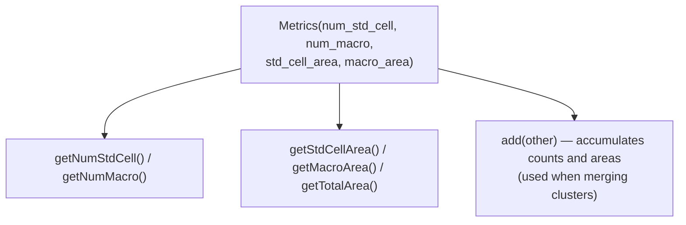
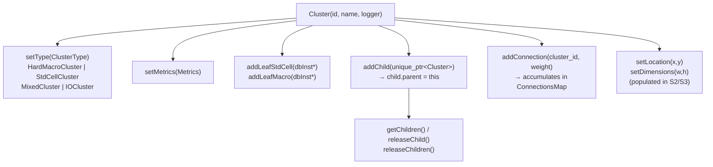
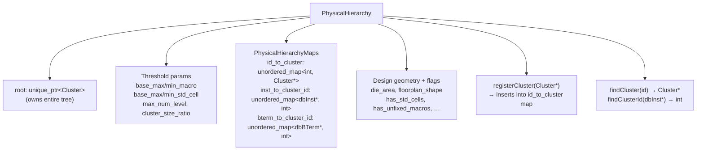

# Flow: ipl — Integrated Placer

`src/ipl/` is a combined macro and standard-cell global placer.  The
implementation is structured in three layers that can be composed
independently: a **cluster data model** (S1a), a **clustering engine**
that populates it from OpenDB (S1b/S1c), and **placement engines** that
assign coordinates to macros (S2) and standard cells (S3).

This FLOW.md is updated each time a new brief is committed; diagrams
reflect the code as it exists now (S1a — data model only).

## `metrics.h` / `metrics.cpp` — instance count and area accumulation

`Metrics` is a plain data container.  `ClusteringEngine` computes a
`Metrics` for each `dbModule` bottom-up, then attaches it to the
corresponding `Cluster`.  `Cluster::setMetrics()` stores it; there is
no further computation inside `Metrics` itself.



## `cluster.h` / `cluster.cpp` — physical hierarchy tree node

`Cluster` is the node type for the physical hierarchy tree.  Each node
holds a type classification, aggregated `Metrics`, leaf instance lists,
and tree links.  Physical coordinates are zero-initialised until S2/S3
populate them.



## `physical_hierarchy.h` / `physical_hierarchy.cpp` — tree owner

`PhysicalHierarchy` owns the root `Cluster` (and therefore the entire
tree via unique_ptr ownership chain).  It also holds the threshold
parameters that `ClusteringEngine` reads to decide when to merge or split,
and the lookup maps that placement engines use for O(1) inst→cluster queries.



## Module-level: layer interactions (S1a state)

```mermaid
sequenceDiagram
    participant IP as IntegratedPlacer
    participant PH as PhysicalHierarchy
    participant C  as Cluster tree

    Note over IP,C: S1a — data model only; no DB traversal yet
    IP->>PH: set threshold params<br/>(base_max_macro, max_num_level, …)
    Note over IP,PH: S1b: ClusteringEngine reads thresholds,<br/>traverses dbModule tree, fills Cluster tree
    IP->>PH: registerCluster(cluster*)
    PH->>C: root owns tree via unique_ptr chain
    Note over IP,C: S2: MacroPlacer reads PH, calls<br/>cluster->setLocation() on macro clusters
    Note over IP,C: S3: AnalyticalPlacer reads PH,<br/>uses inst_to_cluster_id for density kernels
```
